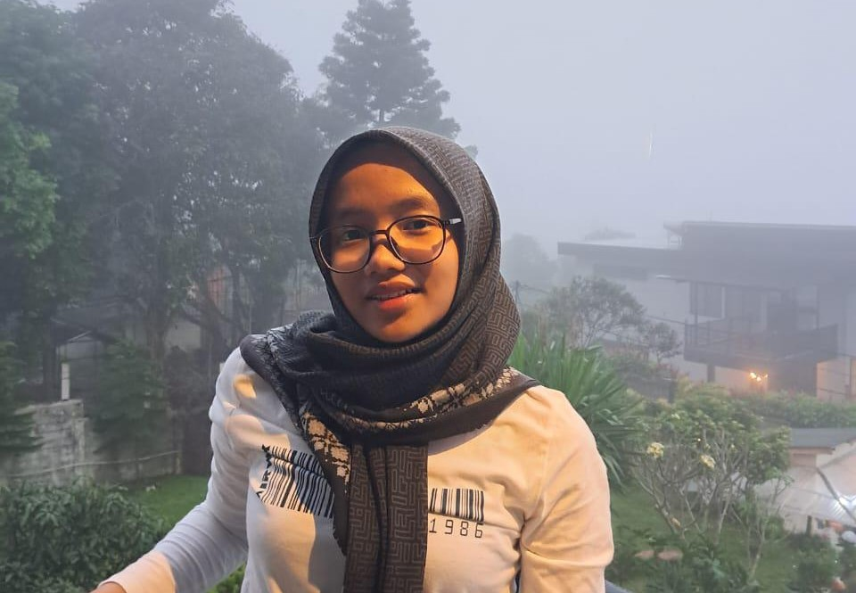

<!-- 🌊☀️ Header dengan tema biru & kuning -->
<h1 align="center" style="color:#FFD700;">
    
  Hi, I'm <span style="color:#FFD700;">Talitha Raissa R.</span> 🌊☀️  
  
</h1>

<p align="center">
  
</p>

---

### 🌻 About Me
✨ Curious learner in IT & Design  
✨ Love exploring new tech & making new friends  
✨ Bringing summer vibes: positive, bright, and creative 🌊☀️  

---

### 🎨 My Interests
- 🌐 Web & App Design  
- 💡 UI/UX & E-Learning  
- 🧩 Conflict Mediation  
- ✈️ Traveling  

---

### 🌐 Connect with Me
<p align="center">
  <a href="https://instagram.com/tha.raiss">
    
  </a>
  <a href="https://github.com/tales1708">
    
  </a>
</p>

---

### 🛠️ Tech Stack
<p align="center">
  
</p>

---

### 📊 GitHub Stats
<p align="center">
  
</p>
<p align="center">
  
  
</p>
<p align="center">
  
</p>

---

### 🏆 Trophies
<p align="center">
  
</p>

---

### 🔥 Activity Graph
<p align="center">
  
</p>

---

### 🌟 Featured Projects
<p align="center">
  <a href="https://github.com/tales1708/your-best-project">
    
  </a>
  <a href="https://github.com/tales1708/another-cool-repo">
    
  </a>
</p>

---

### 🌊☀️ Summer Vibes Corner
```ascii
💙☀️🌻🌴 


